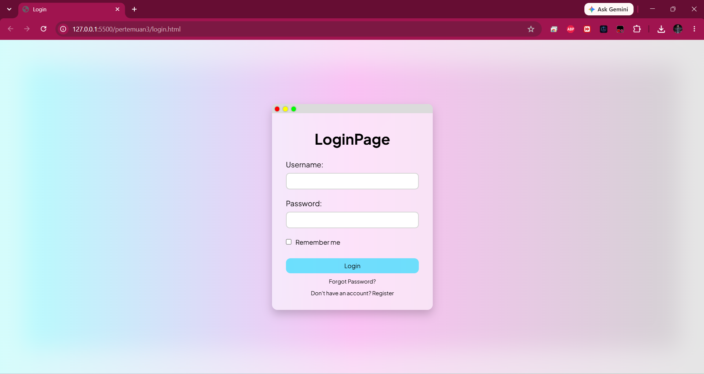

# 🔒 Tugas Pertemuan 3: Glassmorphism Login Page

Proyek ini adalah sebuah halaman login (**Login Page**) modern yang dibangun menggunakan **HTML5** dan **CSS3** murni (Tanpa Framework). Desain mengusung tema **Glassmorphism** dengan efek blur transparan yang estetik dan interaktif.

---

## 📸 Preview Hasil (Screenshot)
Berikut adalah visual dari halaman login yang telah dibuat:

<!-- Simpan screenshot Anda di folder pertemuan3 dengan nama 'preview.png' -->
<p align="center">
  
</p>

---

## ✨ Fitur & Detail Desain

Halaman login ini dirancang dengan memperhatikan detail visual dan kenyamanan pengguna (User Experience):

### 1. Struktur Komponen (HTML5)
* **Mac-Style Window Bar:** Menggunakan komponen `.bar` statis dengan tiga tombol lingkaran (`red`, `yellow`, `green`) di bagian atas form, memberikan impresi aplikasi desktop premium.
* **Form Inputs:** Input teks untuk `Username` dan `Password` yang dilengkapi atribut `required` untuk validasi bawaan HTML.
* **Remember Me:** Fitur checkbox pilihan untuk menyimpan sesi login pengguna.
* **Navigation Links:** Terdapat tautan/link menuju halaman `Forgot Password` dan halaman `Register` jika pengguna belum memiliki akun.

### 2. Efek Visual & Dekorasi (CSS3)
* **Glassmorphism Effect:** Form menggunakan kombinasi warna latar transparan (`background-color: #ffffff86`) dipadukan dengan efek buram di belakangnya (`backdrop-filter: blur(5px)`).
* **Vibrant Gradient Background:** Latar belakang halaman menggunakan kombinasi gradasi linier 3 warna yang dinamis dan modern.
* **Modern Typography:** Mengintegrasikan **Google Fonts: Plus Jakarta Sans** untuk memberikan kesan bersih dan mudah dibaca.
* **Interactive Micro-interactions (Hover & Focus Effects):**
  * Efek bayangan berpendar biru lembut (`box-shadow`) saat form, input, dan tombol lingkaran di-*hover*.
  * Transisi warna tombol submit saat disentuh kursor.
  * Border input yang menyala biru cerah dan memicu *shadow* saat dalam kondisi `:focus`.

---

## 🗂️ Struktur File
```text
pertemuan3/
├── login.html        # File utama (Struktur HTML & CSS internal)
└── preview.png       # Gambar screenshot hasil pengerjaan untuk README
```

---

## 💻 Cara Menjalankan
1. Masuk ke dalam folder `pertemuan3`.
2. Klik dua kali pada file `login.html` untuk membukanya di browser kesayangan Anda.
3. Gunakan fitur *inspect element* untuk melihat detail *layouting* Flexbox yang digunakan untuk menengahkan form secara vertikal dan horizontal.
